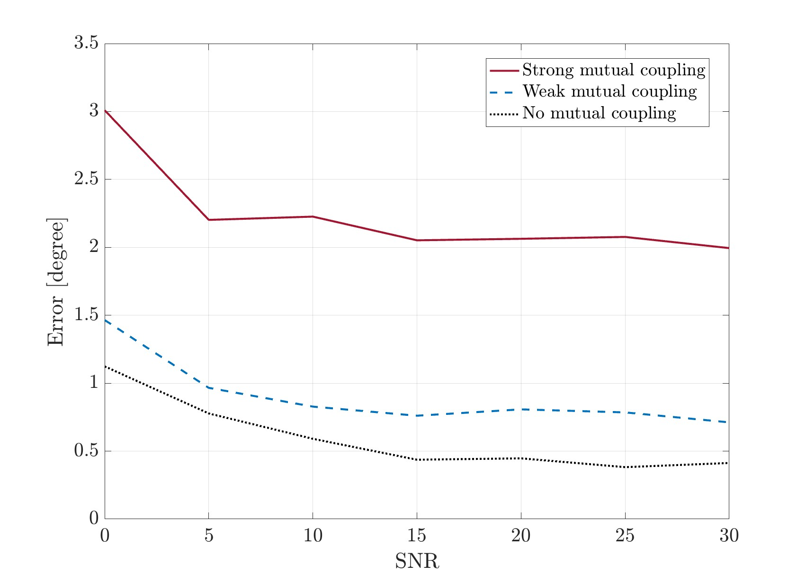

# Basic of Wireless communication: Tutorial
This repository provides simple examples in the wireless communication field. A very basic communication signal follows the pipeline below:
```
 -----------------      --------------------      -------------------      ---------------
|                 |    |                    |    |                   |    |               |
| Synchronization |----| Channel Estimation |----| Data Transmission |----| Data recovery |
|                 |    |                    |    |                   |    |               |
 -----------------      --------------------      -------------------      ---------------

```
Each simulation file examines a specific component of the aforementioned pipeline.
  
# Time of Arrival and Synchronization
It simply cross-correlates the Rx signal with the Tx signal and finds the peak of the correlation function. Longer signal duration results in higher precision in estimating the time of arrival. This step is mandatory to synchronize the clocks in the communication system. In multipath_synchornization.m, a chirp signal is used to accurately detect the first arrived path.

- `TOA_Estimation.m`
  
  
  
- `Multipath_Synchronization.m`
  
  
  

<details>
 <summary> Synchronization Error </summary>
  If the transmitter and receiver are not synchronized, the receiver can not correctly demodulate the signal. The following code demonstrates this phenomenon:
 
  - `SynchronizationError.m`
</details>

# Carrier Frequency Offset
- What is carrier frequency offset (CFO)?

  When there is a mismatch between oscillator generating carrier wave at the transmitter and receiver, a phase shift will be accumulated through time. This accumulated phase shift starts to distruct the detection of the symbol. The following code demonstrates this effect.

-`CarrierFrequencyOffset.m`


Here, the red curve results in an error when decoding symbols. 
  
# Frquency selective channel
The channel behaves as a finite impulse response filter with memory in this scenario. In OFDM system, the channel can be converted to N parallel (orthogonal) channels in the frequency domain by adding cyclic prefixes and applying DFT/IDFT. Then any processing can be done in frequency domain 
- `SimpleInputOutputFIRChannel.m`
- `SimpleOFDMSystem_WidebandConvertToNarrowBand.m`
- `SimpleOFDMSystem_QAM_WithEqualization.m`
- `SimpleOFDMSystem_QAM_WaterFilling_WithRxEqualization.m`
```
                  --------------------          ------      ----------------      ---------      -------      ----------------------      -----      --------------
  QAM symbols    |                    |        |      |    |                |    |         |    |       |    |                      |    |     |    |              |  Demodulated signal
---------------> |    Waterfilling    |--------| IFFT |----| Cyclic prefix  |----| Channel |----| noise |----| Remove cyclic prefix |----| FFT |----| Equalization |--------------------->
                 |                    |        |      |    |                |    |         |    |       |    |                      |    |     |    |              |
                  --------------------          ------      ----------------      ---------      -------      ----------------------      -----      --------------
```
<details>
  <summary> Equalization</summary>
  
  - Zero-Forcing: It inverses the channel effect such that the combined effect of the channel and equalizer leads to the identity operation (interference cancellation). However, it does not account for possible noise amplification. It is effective when the channel matrix is full-rank. The noise amplification happens when the channel is in deep fade where the singular value of channel matrix **H** is low, resulting in large element values of the inverted matrix. 
    
  - Matched Filtering: Maximize the SNR, but it does not consider the possible interference.

  - Minimum Mean Squared Error: It is balancing MF and ZF. In high SNR, it converges to ZF; in low interference, it converges to MF. The derivation of MMSE equalizer is detailed in `Complex_derivative_and_MMSE.pdf`
    
      - **NOTE:** Adding noise power inside the inversion operation suppresses the noise if the channel is in deep fade.
</details>

<details>
  <summary> Waterfilling </summary>
  
- `waterfilling.m` compute assigned power using bisection 
  
- `functionwaterfilling.m` follows the approach explained in [1, section 3.4]
</details>

# Angle of Arrival 
MUSIC and ESPRIT are two classical algorithms to estimate the angle of arrivals [2]. MUSIC requires to know the number of users/peaks in advance. However, it can be estimated.
- `AOA_Estimate_MUSIC.m`
  
- `AOA_Estimate_MUSIC_UnknownUsers.m`
- `AOA_Estimate_MUSIC_vs_ESPRIT.m`

Another method is PDDA [3], which is more computationally efficient. 
- `AOA_Estimation_1D_PDDA.m`


Based on the SNR and the number of snapshots of the channel, PDDA and MUSIC have different accuracy estimates of the angle of arrival. Below, 32 antennas ULA is utilized to collect 8 snapshots and estimate the angle of arrival for one user.


When considering multiple antennas, there is always concern about mutual coupling. Below, it shows how strong coupling can degrade the performance of AoA estimation based on MUSIC. Here, there is a 32 ULA with lambda/4 spacing. 


# Positioning
We can localize a source based on triangulation using two APs or based on trilateration using three APs in the 2D plane. More details can be found in `Trilateration_and_Triangulation.pdf`.
- `PositionEstimate_Triangulation.m`
- `PositionEstimate_Trilateration.m`

  
# References
[1] Björnson, Emil, and Özlem Tuğfe Demir. "Introduction to multiple antenna communications and reconfigurable surfaces." (2024). 

[2] Ramezani, Parisa, Özlem Tuğfe Demir, and Emil Björnson. "Localization in massive MIMO networks: From near-field to far-field." arXiv preprint arXiv:2402.07644 (2024).

[3] Al-Sadoon, Mohammed A G et al. “A New Low Complexity Angle of Arrival Algorithm for 1D and 2D Direction Estimation in MIMO Smart Antenna Systems.” Sensors (Basel, Switzerland) vol. 17,11 2631. 15 Nov. 2017, doi:10.3390/s17112631

# Acknowledgement
I would like to thank my friends and colleagues helped me to collect these codes and information for new students. 

[Miles Turner](https://www.deib.polimi.it/ita/personale/dettagli/1690964)
